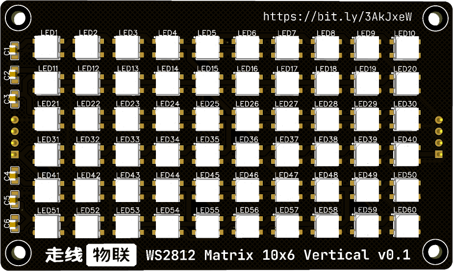
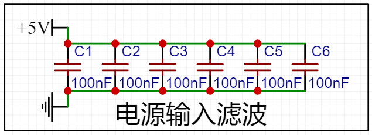
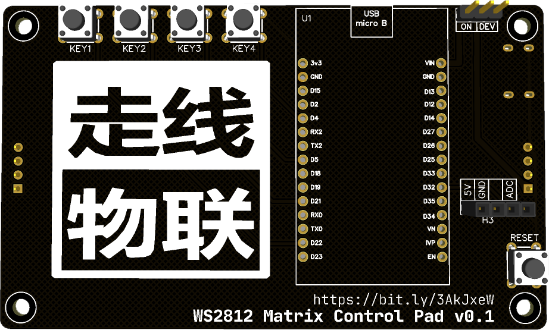

<h1 align="center">MicroPython WS2812 Led Clock</h1>

### 项目介绍

### 硬件介绍

硬件电路使用 [立创EDA](https://lceda.cn/) 设计，完全适合新手小白使用，PCB 板是在 [深圳嘉立创](https://www.jlc.com/) 下单打样的，本着薅羊毛的原则，板子尺寸限制在了`10cm * 10cm`以内

#### Led 矩阵板

Led 使用`C5050WS2812B`封装的灯珠，采用`10 * 6`布局，丝印编号为横向排列，实际电路为**纵向连接**，多个板子可以使用两侧的排针（排母）进行横向串联

电源滤波，没有像其它电路一样给每颗 Led 并联电容，只在电源输入部分进行滤波（实懒）

> 本项目只使用了一块矩阵板

#### Led 主控板

| 正面 | 背面 |
| :-: | :-: |
|  |  |

主控板正面只有一个`Type-C 接口`用于外部电源输入（**仅 5V**）和 2 个排母用于连接固定`Led 矩阵板`

主控板背面包含：

* 4 个自定义功能按键
	* `KEY1`：
	* `KEY2`：
	* `KEY3`：
	* `KEY4`：
* 1 个复位按键`RESET`，用于重启开发板
* 30 Pin 排母，用于接插`ESP32 DEVKIT V1 开发板`
* 4 Pin 排母，用于接插`光敏电阻模块`
* 3 Pin 排针，使用跳线帽切换`正常模式`和`调试模式`
	* `正常模式`：由外部电源为`矩阵板`和`ESP32 开发板`供电
	* `调试模式`：外部电源为`矩阵板`供电，`ESP32 开发板`使用 USB 线与电脑连接

### Led 显示

### 相关项目

* [MicroPython WS2812 Research](https://gitee.com/walkline/micropython-ws2812-research)

### 合作交流

* 联系邮箱：<walkline@163.com>
* QQ 交流群：
	* 走线物联：[163271910](https://jq.qq.com/?_wv=1027&k=xtPoHgwL)
	* 扇贝物联：[31324057](https://jq.qq.com/?_wv=1027&k=yp4FrpWh)

