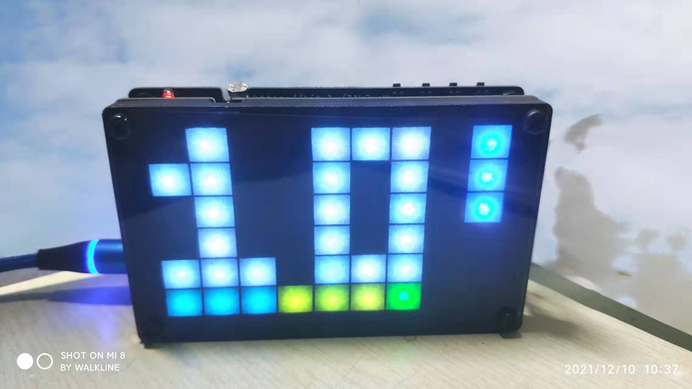

<h1 align="center">MicroPython WS2812 Led Clock</h1>

<p align="center"></p>

### 项目介绍

基于`安信可ESP-C3-12F`模组，搭配`WS2812`矩阵灯珠，用于显示当前时间



### 硬件介绍

硬件电路使用 [立创EDA](https://lceda.cn/) 设计，完全适合新手小白使用，PCB 板是在 [深圳嘉立创](https://www.jlc.com/) 下单打样的，本着薅羊毛的原则，板子尺寸限制在了`10cm * 10cm`以内，原理图文件可以在 [立创开源硬件平台](https://oshwhub.com/Walkline/kou-sou-dian-zhen-shi-zhong) 查看，这里不再赘述

> 主控模组选用了`安信可 ESP-C3-12F`，并非常用的`ESP32-WROOM-32D`

### 软件介绍

#### 工作流程

软件整体工作流程大致如下：

* 第一次启动或复位配网信息时，进入`配网模式`
* 如果输入信息有误，尝试联网`1分钟`后会自动重启并重复以上步骤
* 联网成功后保存`配网信息`（写入`sta_config.py`文件）并自动重启
* 重启后联网校时，并显示当前时间，之后
* 每间隔`5秒`刷新一次时间
* 每间隔`3秒`检测一次环境亮度，如果环境亮度发生变化则自动调整屏幕亮度
* 每间隔`1小时`进行一次联网校时

#### 按键功能

板子上集成了`4个`功能按键和`1个`复位按键，目前按键功能如下：

* `SW1`：长按`3秒`清除`配网信息`（`sta_config.py`文件）并重启
* `SW2`：屏幕闪烁（整点提醒）
* `SW3`：循环切换屏幕显示亮度，但还会根据环境亮度自动调节，仅做调试用
* `SW4`：屏幕显示开关
* `EN`：手动重启设备

#### 关于配网

`MicroPython`不提供`SmartConfig`相关功能，也就是`Touch`和`AirKiss`配网功能，尝试了把`IDF`示例代码编译到固件中调用，目前已经可以使用以上两种方式进行配网了

> `Touch`方式需要使用乐鑫提供的 [EspTouch for Android](https://github.com/EspressifApp/EsptouchForAndroid/releases)

项目中提供的固件已集成`SmartConfig`模块，可用于获取`ssid`和`password`，使用方法和代码如下：

```python
from utime import sleep
import network
import socket
import smartconfig


def inet_pton(ip_str:str):
    '''将字符串 IP 地址转换为字节串'''
    ip_bytes = b''
    ip_segs = ip_str.split('.')

    for seg in ip_segs:
        ip_bytes += int(seg).to_bytes(1, 'little')

    return ip_bytes

def send_ack(local_ip, local_mac):
    '''向手机发送配网完成通知'''
    udp = socket.socket(socket.AF_INET, socket.SOCK_DGRAM)
    udp.setsockopt(socket.SOL_SOCKET, socket.SO_REUSEADDR, 1)

    data = smartconfig.info()[2].to_bytes(1, 'little') + local_mac
    port = 10000 # airkiss 端口号

    if smartconfig.info()[3] == smartconfig.TYPE_ESPTOUCH:
        data += inet_pton(local_ip)
        port = 18266 # esptouch 端口号

    for _ in range(30):
        sleep(0.1)
        try:
            udp.sendto(data, ('255.255.255.255', port))
        except OSError:
            pass

station = network.WLAN(network.STA_IF)
station.active(True)

smartconfig.start()

# 手机连接 2.4G 无线网络（重要）
# 关注 安信可科技 微信公众号，点击 应用开发→微信配网，或
# 关注 乐鑫信息科技 微信公众号，点击 商铺→Airkiss 设备，或
# 安装 EspTouch app，点击 EspTouch
# 输入 Wi-Fi密码 后点击 连接按钮

while not smartconfig.success():
    sleep(0.5)

ssid, password, sc_type, token = smartconfig.info()
print(smartconfig.info())

>>> ('ssid', 'password', 'sc_type', 'token')

# 以下代码用于向手机发送配网完成通知，可选项
station.connect(ssid, password)

while not station.isconnected():
    sleep(0.5)

send_ack(station.ifconfig()[0], station.config('mac'))
```

> 如果长时间获取不到信息，则需要手动重启设备并重试

### Led 显示

由于点阵数量严重不足，经过思考决定使用如下形式显示当前时间


* 最大的区域显示当前时间的`小时`数字
* 最右侧区域显示当前时间分钟数的`十位数`
* 最下边区域显示当前时间分钟数的`个位数`

因此，上图显示的时间为`13点35分`，是不是又能看时间又能活动大脑，一举两得了？

### 如何使用

> 无论是调试代码还是烧录固件，都推荐使用 [AMPY Batch Tool](https://gitee.com/walkline/a-batch-tool)，以下说明均使用`ab 工具`进行讲解

#### 方法一：烧录固件

设备连接到电脑，打开`终端`，输入命令，根据提示信息进行操作即可：

```bash
$ cd path/to/repo
$ ab --flash # 选择 esp32c3 开头的固件文件
```

如果要设置屏幕亮度或其它设置，可以进行如下操作：

```bash
# 修改 config.py 文件相关内容并保存文件
$ ab abc_config
```

根据提示信息选择端口号就可以上传修改后的`config.py`文件，之后重启设备即可

#### 方法二：调试代码

设备连接到电脑，打开`终端`，输入命令：

```bash
$ cd path/to/repo
$ ab # 上传除 main.py 以外的所有文件
$ ab --repl # 进入串口调试

# 使用快捷键 Ctrl+R 选择要调试的文件，如：main.py
# 使用快捷键 Ctrl+Z 退出串口调试
# 快捷键 Ctrl+D 为软重启，Ctrl+X 为硬重启
```

#### 方法三：上传源文件

设备连接到电脑，打开`终端`，输入命令：

```bash
$ cd path/to/repo

# 修改 abconfig 文件，去掉 main.py 前边的'井号'并保存文件
$ ab # 上传所有源文件
```

之后重启设备即可

#### 屏幕测试方法

没有安装最上边的透光板可以使用`TEST`键切换测试效果，如果不方便使用按键测试，可以使用如下方法：

```bash
$ cd path/to/repo
$ ab --repl

# 使用快捷键 Ctrl+R 选择 test\matrix_test.py 文件
>>> test_index=1
>>> test_index=2
>>> test_index=3
>>> test_index=4
>>> test_index=5
>>> test_index=6
```

### 计划增加的功能

* [x] 目前配网时没有任何提示信息，准备增加一个提示画面（或动画）

* [] 计划中还有一个模式切换功能，无非就是手电或者各种乱闪

* [x] 还可以增加一个整点提醒功能

### 存在的问题

* 为了省事没有给每一颗 LED 搭配电容，当全部 LED 以白色最大亮度（255）点亮时，会因为供电不足导致无法继续工作，所以解决方案是降低最大亮度的上限值，目前仅使用`10%`亮度，不使用遮光板的前提下亮度已经足够

* `SmartConfig`偶尔出现卡死的情况，不使用串口调试无法发现，不过无线连接本来就是个概率事件，也能说得过去。。。。吧

* `SmartConfig`在我的`WIFI6`路由器下使用会出现无法发送配网完成通知的情况，无解

### 相关项目

* [MicroPython WS2812 Research](https://gitee.com/walkline/micropython-ws2812-research)

### 合作交流

* 联系邮箱：<walkline@163.com>
* QQ 交流群：
	* 走线物联：[163271910](https://jq.qq.com/?_wv=1027&k=xtPoHgwL)
	* 扇贝物联：[31324057](https://jq.qq.com/?_wv=1027&k=yp4FrpWh)

<p align="center"></p>
